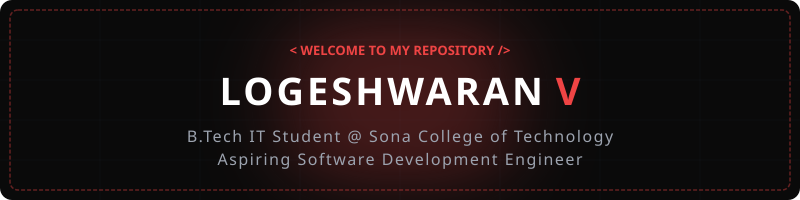
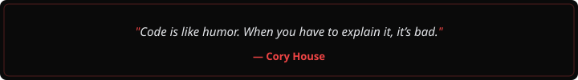
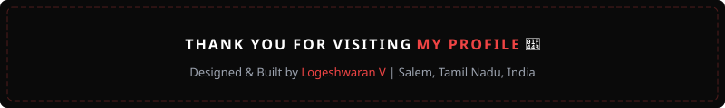

  

  

  
  

  

<h2 align="center"> About Me</h2>

  

  

  Dedicated and passionate technology enthusiast with hands-on experience in building software projects, solving problems, and working with modern tools and technologies. Strong foundation in Java, Full Stack Development, Data Structures & Algorithms, and problem-solving. Committed to writing clean, efficient code and contributing effectively to team-driven development environments.

  
  
  
  
  

 

<h2 align="center"> Career Goal & Core Focus</h2>

<table width="100%" border="0" align="center">
  <tr>
    <td width="50%" align="center" style="padding: 14px;">
      <h4> Career Goal</h4>
      
<b>Software Development Engineer (SDE) / Software Engineer</b> Building robust, scalable, and impactful applications

    </td>
    <td width="50%" align="center" style="padding: 14px;">
      <h4> Core Focus Areas</h4>
      
<b>Java & Full Stack Development</b> Data Structures & Algorithms, Backend, ML

    </td>
  </tr>
  <tr>
    <td width="50%" align="center" style="padding: 14px;">
      <h4> Key Strengths</h4>
      
<b>Problem Solving & Work Ethic</b> Time Management & Creativity

    </td>
    <td width="50%" align="center" style="padding: 14px;">
      <h4> Collaboration</h4>
      
<b>Open Source & Team Projects</b> Eager to contribute and learn continuously

    </td>
  </tr>
</table>

 

<h2 align="center"> Featured Projects</h2>

<table width="100%" border="0" align="center">
  <tr>
    <td align="left" style="padding: 18px;">
      <h3> 1. OffGridLink</h3>
      
<i>An offline-first quiz platform designed for educational environments with limited or no internet connectivity.</i>

      <ul>
        <li>Enabled teachers to create, manage, and distribute quizzes via peer-to-peer networking over local Wi-Fi.</li>
        <li>Built offline storage using PouchDB with optional cloud synchronization using CouchDB.</li>
      </ul>
      

        
      

      

        
      

    </td>
  </tr>
  <tr>
    <td align="left" style="padding: 18px;">
      <h3> 2. Laundry & Dry-Cleaning Service Platform</h3>
      
<i>A scalable full-stack laundry service application developed using the MERN stack.</i>

      <ul>
        <li>Implemented role-based JWT authentication for Customer, Laundry Owner, and Delivery Person roles.</li>
        <li>Built pickup scheduling, live order tracking, dynamic fabric-based pricing, loyalty rewards, and an image-based complaint module.</li>
      </ul>
      

        
      

    </td>
  </tr>
  <tr>
    <td align="left" style="padding: 18px;">
      <h3> 3. Groundwater Prediction Using Machine Learning</h3>
      
<i>A machine learning project for predicting groundwater levels using rainfall and groundwater-level patterns.</i>

      <ul>
        <li>Uses rainfall and groundwater-level patterns for machine learning-based predictions.</li>
        <li>Engineered with FastAPI backend, PostgreSQL database, React with TypeScript frontend, and XGBoost machine learning model.</li>
      </ul>
      

        
      

    </td>
  </tr>
</table>

 

<h2 align="center"> Internship Project</h2>

<table width="100%" border="0" align="center">
  <tr>
    <td align="left" style="padding: 18px;">
      <h3> BuildTrack</h3>
      
<b>Role:</b> Backend Developer

      
<i>Construction Project Management and Site Monitoring Platform.</i>

      <ul>
        <li>Designed and implemented robust backend services, REST API endpoints, and database models.</li>
        <li>Integrated secure authentication and data persistence for site monitoring metrics.</li>
      </ul>
      

        
      

    </td>
  </tr>
</table>

 

<h2 align="center"> Tech Stack & Skills</h2>

<b>Programming Languages</b>

  

<b>Web Development & Frontend</b>

  

<b>Backend & Frameworks</b>

  

<b>Databases & Machine Learning</b>

  

  

<b>Tools & Technologies</b>

  

<b>Technical Core Skills</b>

  
  
  
  
  

 

<h2 align="center"> Certifications & Awards</h2>

<table width="100%" border="0" align="center">
  <tr>
    <td width="50%" align="left" style="padding: 14px;">
      <h4> Certifications</h4>
      <ul>
        <li>NPTEL Design Thinking (2023)</li>
        <li>NPTEL Java Programming (2024)</li>
        <li>NPTEL Introduction to IoT (2025)</li>
        <li>NASSCOM Digital 101 (2026)</li>
        <li>Infosys Springboard Python (2023)</li>
        <li>NASSCOM Data Preprocessing (2026)</li>
      </ul>
    </td>
    <td width="50%" align="left" style="padding: 14px;">
      <h4> Awards</h4>
      <ul>
        <li>Appreciation Award (2024)</li>
      </ul>
    </td>
  </tr>
</table>

 

<h2 align="center"> Education</h2>

<table width="100%" border="0" align="center">
  <tr>
    <td width="50%" align="left" style="padding: 14px;">
      <h4> Sona College of Technology</h4>
      
<b>Degree:</b> B.Tech – Information Technology 
      <b>Duration:</b> 2023 – 2027 
      <b>CGPA:</b> 8.25

    </td>
    <td width="50%" align="left" style="padding: 14px;">
      <h4> Bharathiyar Matric Higher Secondary School</h4>
      
<b>Duration:</b> 2021 – 2023 
      <b>HSC:</b> 87% 
      <b>SSLC:</b> All Pass

    </td>
  </tr>
</table>

 

<h2 align="center"> Co-Curricular Activities</h2>

<table width="100%" border="0" align="center">
  <tr>
    <td align="left" style="padding: 14px;">
      <ul>
        <li><b>Techathon</b> – 2nd Round Qualifier (2024)</li>
        <li><b>Smart India Hackathon (SIH)</b> – Participant (2023)</li>
        <li><b>Persona</b> – Participant (2026)</li>
        <li><b>Apithon</b> – Participant (2024)</li>
      </ul>
    </td>
  </tr>
</table>

 

<h2 align="center"> GitHub Analytics & Activity</h2>

  
  

  

  

 

<h2 align="center"> Contribution Journey</h2>

  

 

<h2 align="center"> Let's Connect & Collaborate</h2>

<i>Feel free to reach out for project collaborations, software development discussions, or tech opportunities!</i>

<table border="0" align="center">
  <tr>
    <td align="center" width="220" style="padding: 16px;">
      <a href="mailto:logeshwaranv19@gmail.com">
        
          
        
      </a>
       
      <b>Direct Contact</b>
    </td>
    <td align="center" width="220" style="padding: 16px;">
      <a href="https://github.com/Logeshwaranv19" target="_blank">
        
          
        
      </a>
       
      <b>Code & Repositories</b>
    </td>
  </tr>
</table>

  

